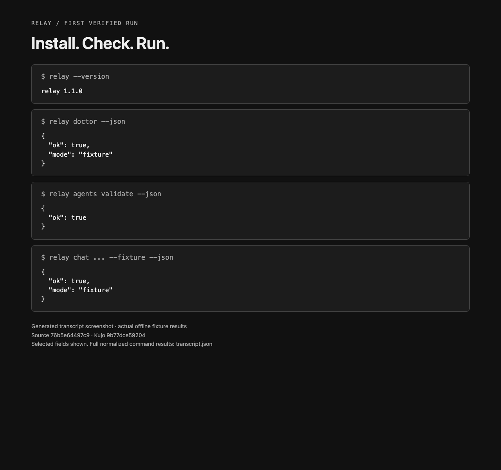
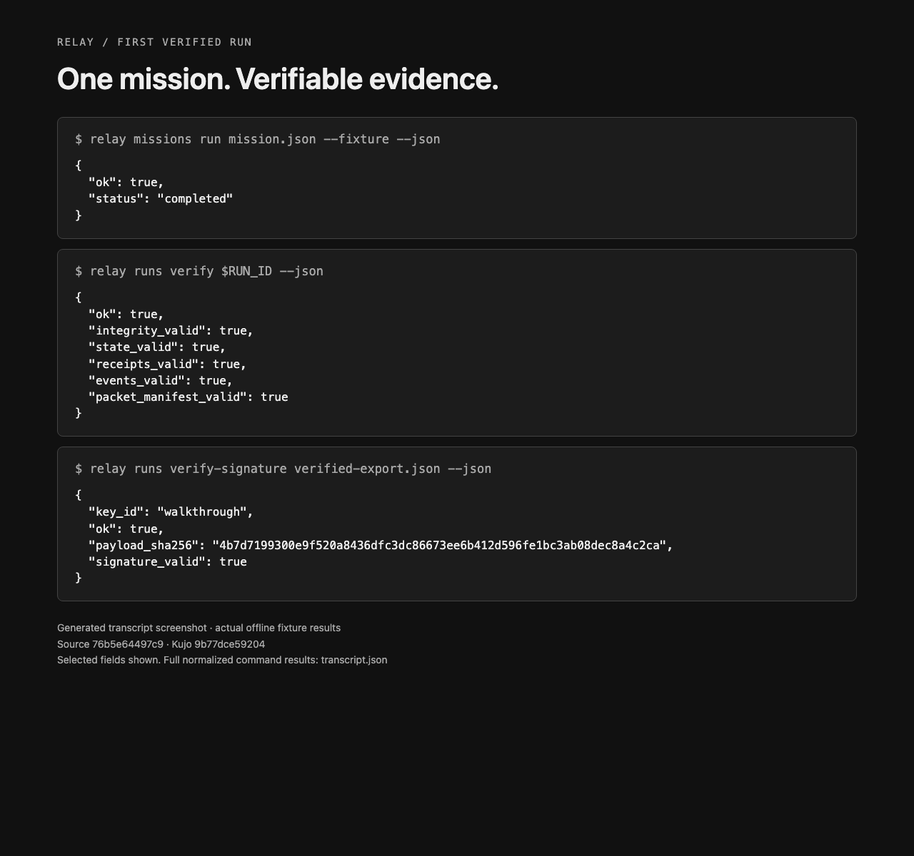

# Your first verified Relay run

Start with a disposable workspace and an offline fixture. You will install Relay,
run a bounded mission, inspect its evidence and verify an export without the
original run store. No provider credentials or provider calls are needed after
source dependencies are installed. Linux and macOS are the supported target hosts.

## 1. Install the pinned source set

You need Git, Python 3, Rust/Cargo and the usual native build tools for your host.
The repository's release gate also uses Bash, Ruby and jq. Work in a new parent
directory; never run the clone loop over existing sibling checkouts.

```bash
mkdir relay-first-run
cd relay-first-run
git clone https://github.com/kujolang/relay.git
cd relay
# Select the reviewed candidate SHA or release tag you intend to test.
git checkout <reviewed-candidate-or-release-tag>
python3 - <<'PY'
import json, pathlib, subprocess
root = pathlib.Path.cwd()
for name, pin in json.loads((root / 'release/dependencies.json').read_text())['dependencies'].items():
    if not pin['required']:
        continue
    target = root.parent / name
    if target.exists():
        raise SystemExit(f'Refusing to replace existing checkout: {target}')
    subprocess.run(['git', 'clone', f'https://github.com/kujolang/{name}.git', str(target)], check=True)
    subprocess.run(['git', '-C', str(target), 'checkout', '--detach', pin['revision']], check=True)
PY
cargo build --release --locked --manifest-path ../kujo/Cargo.toml --bin kujo
export KUJO_BIN="$(cd ../kujo && pwd -P)/target/release/kujo"
./bin/relay --version
```

Replace the checkout placeholder before running it. Use the immutable revisions
in [release/dependencies.json](../release/dependencies.json), not a newer Kujo
binary just because its version number is higher. Source access may require your
GitHub credentials. Relay never downloads or updates these dependencies at runtime.

## 2. Run the isolated walkthrough

```bash
python3 scripts/fixture_walkthrough.py --output /tmp/relay-first-run-evidence
```

Choose an output directory that does not already exist. The script validates the
required dependency commits, installs `git archive HEAD` into a fresh temporary
home, and supplies only explicit runtime/dependency environment values. It calls
the installed `bin/relay`, not the source checkout's launcher. Your normal state,
provider credentials, signing keys and configuration are not inherited.

The temporary repository, mission and state are deleted afterward. The output
folder retains a normalized JSON command transcript, a provenance receipt and
two HTML transcript views. These are real command results; machine-specific
paths and the run ID are replaced with placeholders for sharing.



Generated transcript screenshot, with selected fields from a verified offline
run. [Full transcript](walkthrough/transcript.json) · [receipt](walkthrough/receipt.json).
Screenshots record the source commit shown in their footer; they are illustrative
component evidence, not a claim that every later candidate has been verified.

## 3. Understand the commands

The script executes these operations against its own disposable state:

```bash
relay --version
relay doctor --json
relay agents validate --json
relay chat "Summarize the mission boundary" --fixture --json
relay missions run mission.json --fixture --json
relay runs verify <run-id> --json
relay runs export <run-id> --signed --key-id walkthrough --output verified-export.json --json
relay runs verify-signature verified-export.json --json
```

These lines illustrate the recorded sequence; `relay`, `mission.json` and the run
ID are created/resolved by the script. For manual use, invoke `./bin/relay` and
supply your own paths. The final two commands need an operator-owned signing key;
the walkthrough generates a temporary random fixture key in memory and does not
save it. Verification points at an absent state root, proving that the signed
bundle can be authenticated without its originating store. The temporary export
is intentionally not retained because its disposable signing key is discarded.
For durable exports, follow the [key ownership and rotation guide](enterprise-boundaries.md).



`runs verify` checks state and required evidence, not merely process exit status.
HMAC verification authenticates a bundle under the supplied shared key; it is not
a public-key signature or a claim that a model's answer is correct. Fixture mode
proves the local workflow; external model compatibility still needs the approved
[Watchdog provider test](live-provider-verification.md).

## 4. Reproduce the screenshots

Pass an installed Chromium-family executable to the same script:

```bash
python3 scripts/fixture_walkthrough.py \
  --output /tmp/relay-first-run-with-images \
  --browser /absolute/path/to/chromium
```

The browser renders the generated local HTML with a separate temporary profile.
The script captures complete PNGs and shuts down only its own browser process
group. Without `--browser`, the complete installation-to-export verification still
runs; the portable smoke test uses that mode on the CI platform matrix.

## 5. Follow the Kujo code

Relay shows how a Kujo program combines data contracts, policy, processes and
verifiable state. Start with the small [entry point](../main.kujo), then read
[command dispatch](../src/cli.kujo), [mission contracts](../src/contracts.kujo)
and [policy decisions](../src/policy.kujo). The [architecture map](architecture.md)
keeps ownership and dependencies visible.

For the language itself, try the official [Kujo quickstart](https://docs.kujolang.ai/quickstart/),
then [language learning path](https://docs.kujolang.ai/learn/) and
[AI/application build paths](https://docs.kujolang.ai/build/). Those guides follow
the current language; this Relay candidate still uses its committed runtime pin.
Edit the fixture mission's goal and acceptance criteria first, then inspect the
resulting receipts before moving to a real provider or a write-enabled mission.
